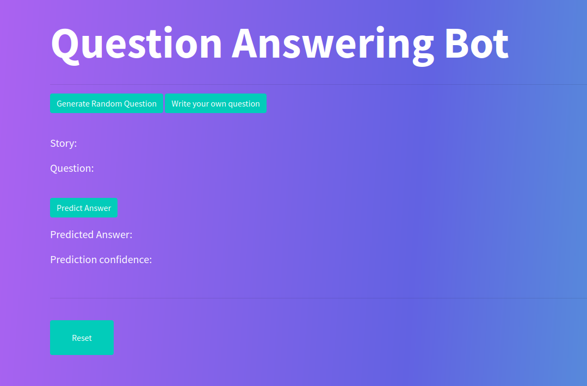

# Repository containing implementation of Memory Networks Model

This is basically model that is able to refine meaning from a simple sentence and answer "yes" / "no" for a posed question about this sentence

Implementation was done based on attached [memory_networks.pdf](/question_answering_bot/memory_networks.pdf)

App is currently deployed [here](https://memory-networks.cytr.us/)

### Build
Docker image under this [link](https://hub.docker.com/repository/docker/kurdzik/memory_networks/tags?page=1&ordering=last_updated)

